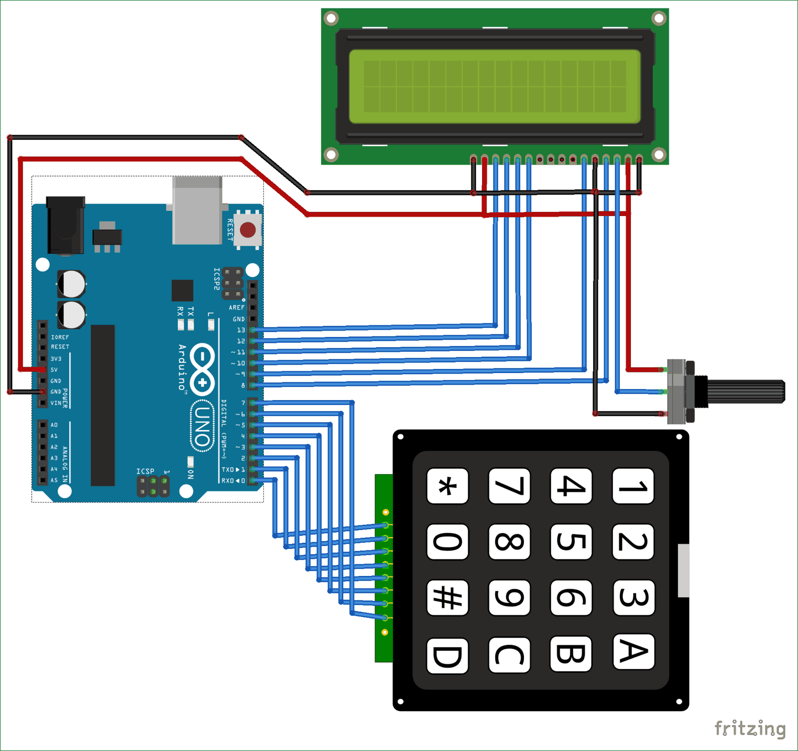
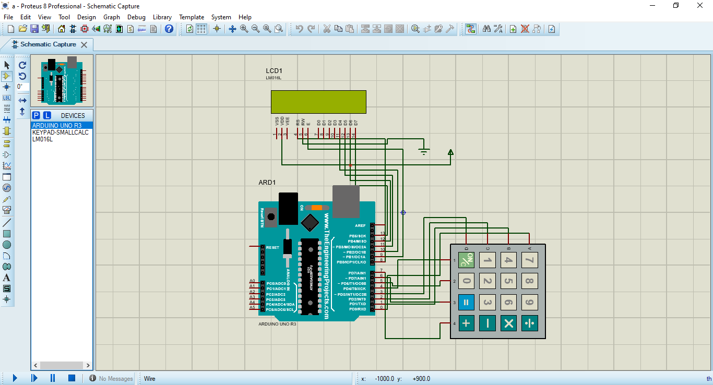

# *`Arduino Simple Calculator`*

Simple calculator built with [Arduino Uno Rev3](https://store.arduino.cc/en-de/products/arduino-uno-rev3) board

  
  
  

## *`About this repository`*

This repository contains source code, compiled Arduino files (at the `build` directory) and necessary files for simulating the board in Proteus 8 (at the `proteus` directory).

  

## *`Dependent libraries`*

1. [LCD library (Arduino official)](https://www.arduino.cc/reference/en/libraries/liquidcrystal/)

2. [Keypad library (by Chris--A)](https://github.com/Chris--A/Keypad/)

## *`Simulate in Proteus 8`*

This project can be simulated in [Proteus 8](https://www.labcenter.com/). The whole project and the compiled source (for developing re-creating the project) is available to use in Proteus.

[Arduino Uno library for Proteus 8 (From THP website)](https://www.theengineeringprojects.com/2015/12/arduino-uno-library-proteus.html)

> [!NOTE]  
> Arduino Uno library for Proteus 8 is only required if you want to simulate the board in Proteus 8. Otherwise, it's not a dependency for board development.

> [!WARNING]  
> If you want to simulate the board in Proteus 8, be sure to choose the compiled `.hex` file (from the `build` directory) for the board in Proteus 8 enviroment. You can also compile the source code personally using the Arduino IDE.

